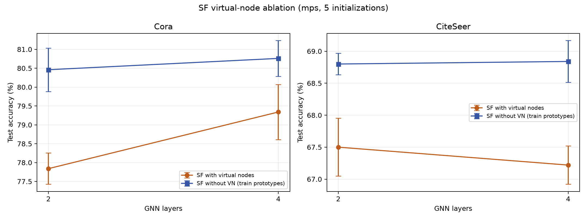

# SF 有/无虚拟节点对照实验

设备：`mps`；数据集：Cora, CiteSeer；固定 Planetoid public split；随机初始化种子：[41, 42, 43, 44, 45]。

GCN 隐藏维度 64，层数 [2, 4]，每层固定 500 次局部更新；Adam lr=0.001、weight_decay=0.0005。

VN 组沿用类别虚拟节点及训练标签连边。无 VN 组不扩展图、不增加节点或边；以训练节点隐藏表示的类别均值作为原型，训练时正类原型采用 leave-one-out，避免样本与自身直接匹配。推理只使用训练节点生成原型，不使用验证/测试标签。

两组的 GNN 层权重按种子配对初始化，层宽、深度、局部交叉熵、训练预算和验证策略一致。固定预算训练，不按测试集选检查点。无 VN 组的原型读出与 VN 组并非完全相同的参数化，因此应将结果解释为“虚拟节点上下文 vs. 无节点原型上下文”，而非只删除节点后的完全等价算法。

测试准确率均值 ± 总体标准差（不同初始化；固定公开划分）：

| 数据 | 层数 | 条件 | n | 测试准确率 | 平均训练秒 |
|---|---:|---|---:|---:|---:|
| Cora | 2 | SF + VN | 5 | 77.84 ± 0.41% | 5.75 |
| Cora | 2 | SF，无 VN（原型） | 5 | 80.46 ± 0.57% | 5.43 |
| Cora | 4 | SF + VN | 5 | 79.34 ± 0.73% | 9.42 |
| Cora | 4 | SF，无 VN（原型） | 5 | 80.76 ± 0.47% | 10.19 |
| CiteSeer | 2 | SF + VN | 5 | 67.50 ± 0.45% | 6.97 |
| CiteSeer | 2 | SF，无 VN（原型） | 5 | 68.80 ± 0.17% | 6.89 |
| CiteSeer | 4 | SF + VN | 5 | 67.22 ± 0.30% | 10.69 |
| CiteSeer | 4 | SF，无 VN（原型） | 5 | 68.84 ± 0.33% | 11.00 |

按相同初始化配对的测试准确率差值（无 VN 原型 − SF-VN）：

| 数据 | 层数 | 配对数 | 平均差值 ± 标准差（百分点） | 每个初始化方向 |
|---|---:|---:|---:|---|
| Cora | 2 | 5 | +2.62 ± 0.25 | +2.5, +2.9, +2.2, +2.7, +2.8 |
| Cora | 4 | 5 | +1.42 ± 0.69 | +1.7, +1.6, +1.3, +0.2, +2.3 |
| CiteSeer | 2 | 5 | +1.30 ± 0.56 | +1.7, +0.9, +1.0, +0.7, +2.2 |
| CiteSeer | 4 | 5 | +1.62 ± 0.31 | +2.0, +1.3, +2.0, +1.4, +1.4 |

测试集只在每个模型训练结束后用于最终评估；验证集曲线用于检查训练过程但不选择检查点。当前种子只改变初始化，不改变 Planetoid 的固定公开划分，因此结果不能估计数据划分不确定性。

逐次原始结果见同目录 JSON；测试指标为描述性统计，不代表普遍结论。
