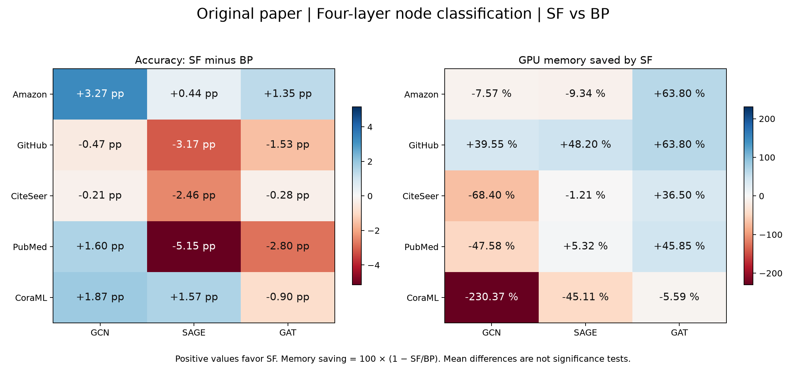
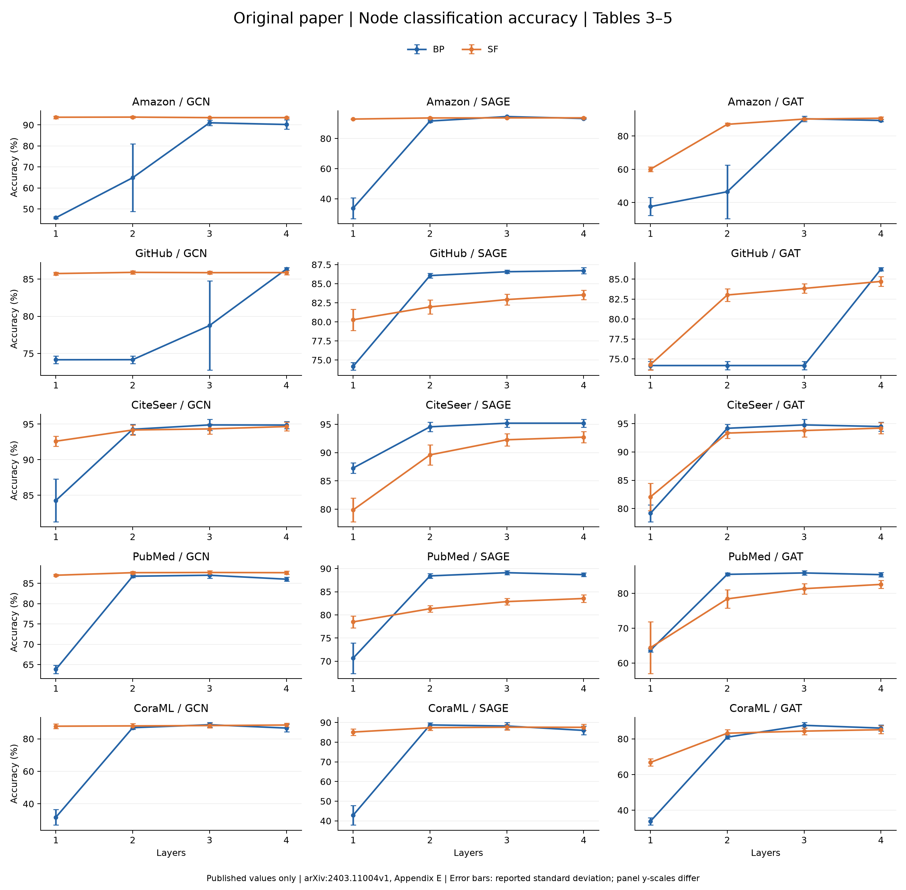
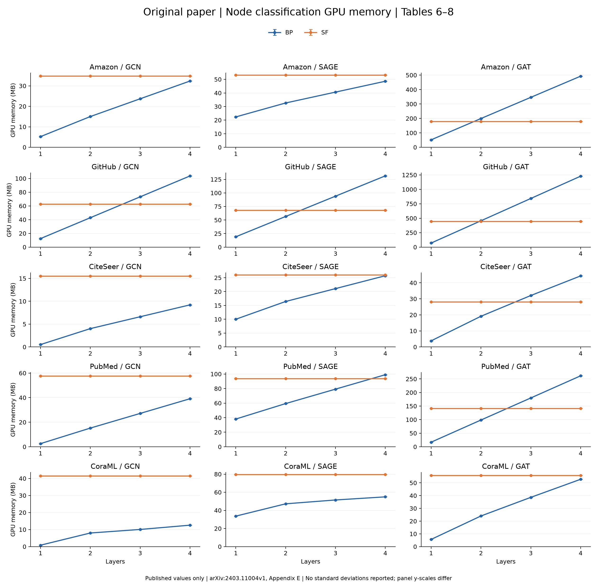
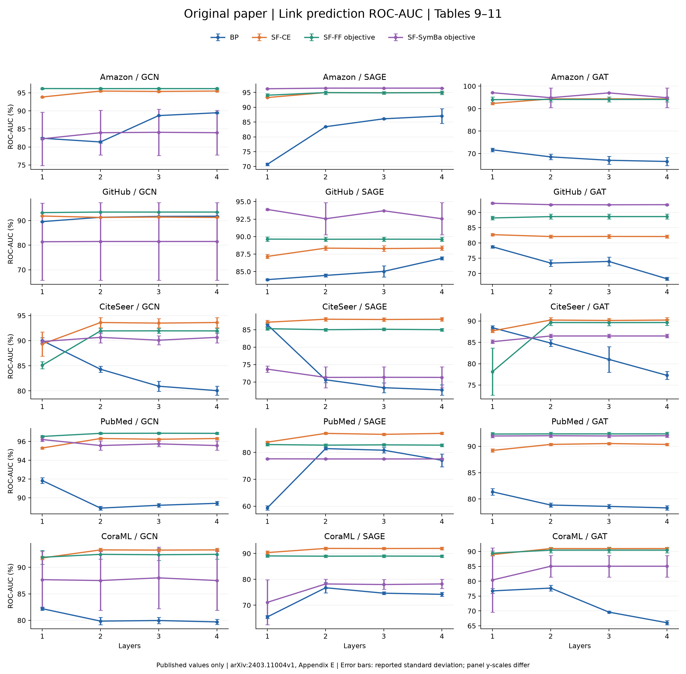
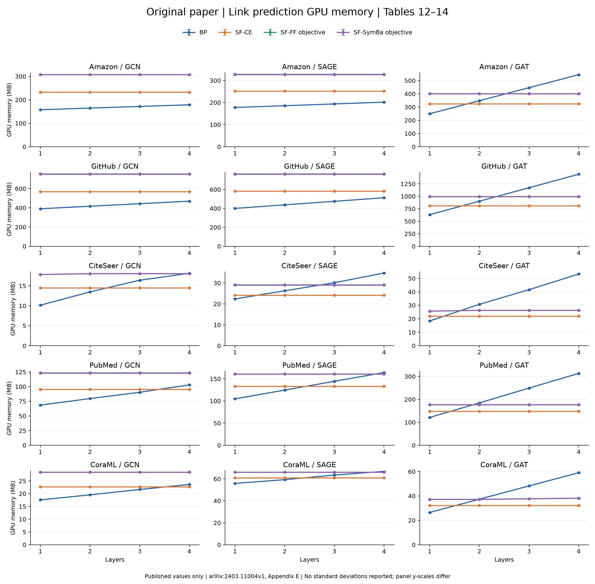
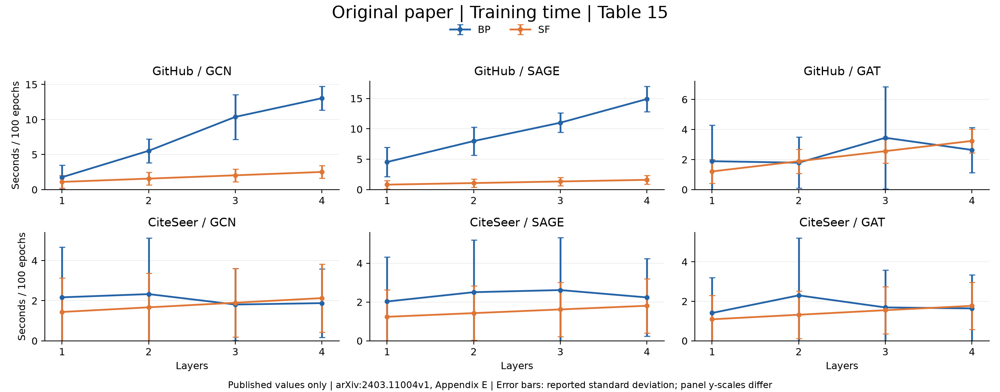

# 原论文附录 E：SF 与 BP 的准确率和 GPU 显存

来源：[Forward Learning of Graph Neural Networks，arXiv v1，Appendix E](https://arxiv.org/html/2403.11004v1#A5)。全部为原论文发布值，不是本机 MPS 实测。

## 覆盖范围与口径

- Table 3–16 全部 14 张编号表、23 个表格面板已提取，完整保留所有方法的原始单元格，见 [原表数据](tables.md)。
- 节点分类：5 个数据集 × 3 个骨干 × 4 个深度，比较基础 SF（Sec. 3.2）与 BP；top-down 变体未混入基础 SF。
- 链接预测指标是 ROC-AUC，不是 Accuracy。原表以 ForwardGNN-CE、ForwardGNN-FF、ForwardGNN-SymBa 命名局部目标变体，图中分别标为 SF-CE、SF-FF objective、SF-SymBa objective，均与 BP 单独比较；不把 FF objective 当作节点分类的 FF-LA/FF-VN。
- 准确率与 AUC 使用百分数，误差条为五次运行的原表标准差，均值差不代表显著性。GPU 显存保留论文 MB 单位，不附加不存在的误差条。
- E.4 的 Table 16 仅包含数据集统计；该节精度/显存以及 E.5 方向性实验由图片给出，本次不从图中估读数值。
- Table 15 的训练时间另行绘图。论文 H100 显存与本机 MPS 的采样张量/驱动峰值分开保存，不直接混比绝对数值。

## 四层节点分类

| 数据集 | 骨干 | BP accuracy % | SF accuracy % | SF−BP（百分点） | BP MB | SF MB | SF 显存下降 % |
|---|---|---:|---:|---:|---:|---:|---:|
| Amazon | GCN | 90.21 | 93.48 | +3.27 | 32.36 | 34.81 | -7.57 |
| Amazon | SAGE | 93.27 | 93.71 | +0.44 | 48.61 | 53.15 | -9.34 |
| Amazon | GAT | 89.33 | 90.68 | +1.35 | 492.84 | 178.39 | +63.80 |
| GitHub | GCN | 86.34 | 85.87 | -0.47 | 103.62 | 62.64 | +39.55 |
| GitHub | SAGE | 86.71 | 83.54 | -3.17 | 131.46 | 68.10 | +48.20 |
| GitHub | GAT | 86.24 | 84.71 | -1.53 | 1228.98 | 444.83 | +63.80 |
| CiteSeer | GCN | 94.87 | 94.66 | -0.21 | 9.21 | 15.51 | -68.40 |
| CiteSeer | SAGE | 95.20 | 92.74 | -2.46 | 25.72 | 26.03 | -1.21 |
| CiteSeer | GAT | 94.49 | 94.21 | -0.28 | 44.30 | 28.13 | +36.50 |
| PubMed | GCN | 86.01 | 87.61 | +1.60 | 39.11 | 57.72 | -47.58 |
| PubMed | SAGE | 88.69 | 83.54 | -5.15 | 99.04 | 93.77 | +5.32 |
| PubMed | GAT | 85.37 | 82.57 | -2.80 | 261.51 | 141.61 | +45.85 |
| CoraML | GCN | 86.61 | 88.48 | +1.87 | 12.58 | 41.56 | -230.37 |
| CoraML | SAGE | 85.98 | 87.55 | +1.57 | 54.93 | 79.71 | -45.11 |
| CoraML | GAT | 86.04 | 85.14 | -0.90 | 52.80 | 55.75 | -5.59 |

四层的 15 组数据集/骨干组合中，SF 显存更低 7 组，准确率均值更高 6 组。SF 的显存随层数增长较平稳，但绝对显存和准确率优势都依赖具体配置。不能将均值胜出计数视为显著性检验。

## 节点分类 Accuracy

[SVG](node_accuracy.svg) · [PDF](node_accuracy.pdf)

## 节点分类 GPU memory

[SVG](node_gpu_memory.svg) · [PDF](node_gpu_memory.pdf)

## 链接预测 ROC-AUC

[SVG](link_roc_auc.svg) · [PDF](link_roc_auc.pdf)

## 链接预测 GPU memory

[SVG](link_gpu_memory.svg) · [PDF](link_gpu_memory.pdf)

## 训练时间

[SVG](node_training_time.svg) · [PDF](node_training_time.pdf)

## 可追溯数据与重绘

[全部表格 JSON](../../../../paper_reproduction/reference/appendix_e_tables.json) · [SF/BP 数值 JSON](../../../../paper_reproduction/reference/appendix_e_sf_bp.json) · [逐配置差值](paired_comparisons.json)

源码 HTML 固定在 `paper_reproduction/reference/source/forwardgnn_2403.11004v1.html`；JSON 含来源锚点及 SHA256。已与先前独立整理的 GitHub 全部准确率/标准差/显存值交叉核验。

重绘：`conda run -n gnn-research python -m paper_reproduction.experiments.plot_appendix_results`。
