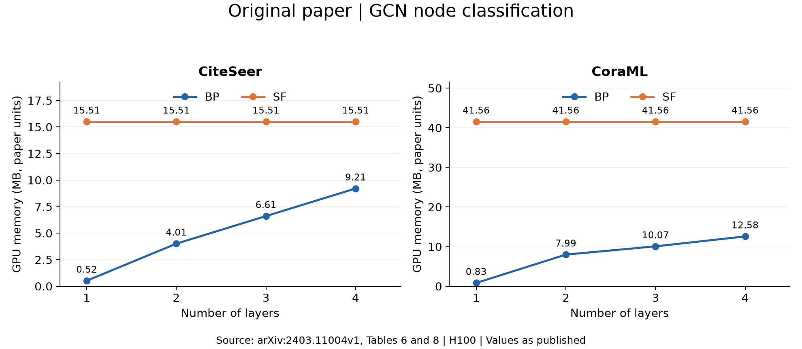
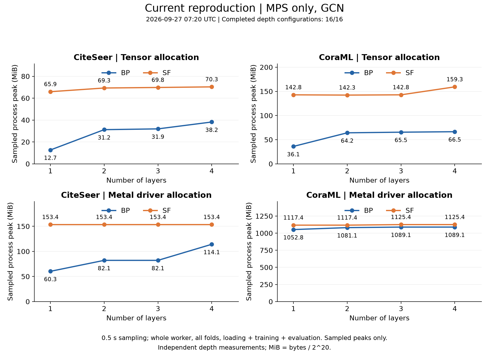
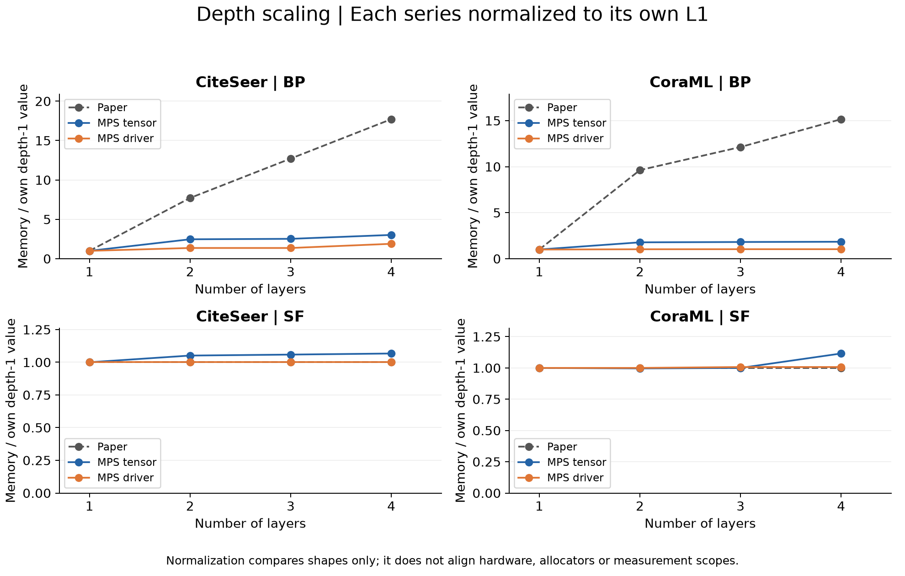

# 原论文与 MPS 复现显存比较

生成时间：2026-09-27 07:20 UTC；完整显存配置 16/16。

范围：CiteSeer / CoraML，GCN 节点分类，BP / SF。不是全论文全部骨干和任务。

本机环境：PyTorch 2.10.0 / PyG 2.8.0.post1，macOS-27.0-arm64-arm-64bit，MPS。每配置 5 折，隐藏维度 128，最多 1000 epoch，每两轮验证、patience=100，采样间隔 0.5 秒。

## 数据与口径

- 论文数据：[arXiv v1，Tables 6、8](https://arxiv.org/html/2403.11004v1#A5.T6)，保留原文 MB 单位。原文表格及已检查的官方训练代码未明确给出对应采样 API、基线扣除方法和缓存范围，不能假定与当前指标一致。
- [PyTorch MPS API](https://docs.pytorch.org/docs/stable/mps.html)：张量内存不含分配器缓存；驱动分配包含缓存及 MPS/MPSGraph 分配。单位 MiB，按字节 / 2^20 换算。
- 当前值为每个配置进程的采样最大值，包含五折、加载、训练、验证和测试，不是五折均值或精确瞬时峰值。短暂张量尖峰可能漏采，采样曲线不保证单调；驱动曲线还受缓存影响。
- 主复现的 SF 进程运行四层配置；SF L1～L3 使用额外独立 setting、独立进程，仍为五折和完整预算。未测点不插值，未结束 worker 标为 incomplete，数值只是目前下界。
- 训练使用 MPS，关闭算子 CPU fallback。数据加载和汇总在 CPU。主矩阵和 SF 补测各自串行，两个驱动并行运行；记录的是各进程自身的内存，时间不用于性能基准，资源竞争可能影响采样时刻。

## 实测数据

| 数据 | 方法 | 层数 | 张量峰值 MiB | 驱动峰值 MiB | 状态 |
|---|---|---:|---:|---:|---|
| CiteSeer | BP | 1 | 12.66 | 60.30 | completed |
| CiteSeer | BP | 2 | 31.23 | 82.14 | completed |
| CiteSeer | BP | 3 | 31.95 | 82.14 | completed |
| CiteSeer | BP | 4 | 38.23 | 114.14 | completed |
| CiteSeer | SF | 1 | 65.92 | 153.42 | completed |
| CiteSeer | SF | 2 | 69.29 | 153.42 | completed |
| CiteSeer | SF | 3 | 69.78 | 153.42 | completed |
| CiteSeer | SF | 4 | 70.33 | 153.42 | completed |
| CoraML | BP | 1 | 36.08 | 1052.83 | completed |
| CoraML | BP | 2 | 64.22 | 1081.14 | completed |
| CoraML | BP | 3 | 65.51 | 1089.14 | completed |
| CoraML | BP | 4 | 66.51 | 1089.14 | completed |
| CoraML | SF | 1 | 142.84 | 1117.41 | completed |
| CoraML | SF | 2 | 142.30 | 1117.41 | completed |
| CoraML | SF | 3 | 142.85 | 1125.41 | completed |
| CoraML | SF | 4 | 159.31 | 1125.41 | completed |

## 比较

论文中 BP 的 L4/L1 倍数为 CiteSeer 17.71、CoraML 15.16；SF 在两数据集均为 1.00。这里 SF 的绝对值仍高于 BP，稳定的深度趋势不等于绝对显存更低。

CiteSeer 的 MPS BP 从 L1 到 L4：张量采样峰值 12.66 → 38.23 MiB（3.02 倍）；驱动峰值 60.30 → 114.14 MiB（1.89 倍）。
CoraML 的 MPS BP 从 L1 到 L4：张量采样峰值 36.08 → 66.51 MiB（1.84 倍）；驱动峰值 1052.83 → 1089.14 MiB（1.03 倍）。
CiteSeer 的 MPS SF L4/L1：张量峰值 1.07 倍，驱动峰值 1.00 倍。
CoraML 的 MPS SF L4/L1：张量峰值 1.12 倍，驱动峰值 1.01 倍。

硬件、软件、单位和测量范围不同，不计算“对论文显存误差百分比”，也不据此宣称复现或推翻 H100 显存结论。

重绘命令：`conda run -n gnn-research python -m paper_reproduction.experiments.plot_memory_comparison --setting core_nodeclass_mps_memory --extra-settings core_nodeclass_mps_memory_sf_depth1 core_nodeclass_mps_memory_sf_depth2 core_nodeclass_mps_memory_sf_depth3`

原始测量来源见 [MPS CSV](mps_memory.csv) 的 source 列；原论文数值见 [论文 CSV](paper_memory.csv)。

矢量图：[论文](paper_memory.svg)、[MPS](mps_memory.svg)、[深度归一化比较](memory_depth_scaling.svg)。
